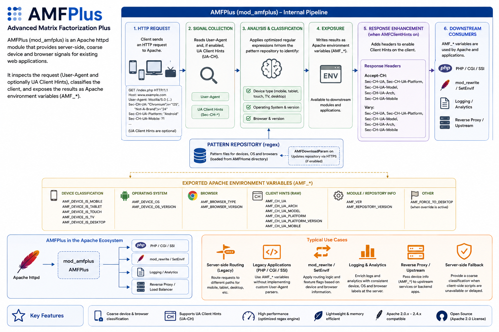

# AMFPlus

Apache Mobile Filter Plus (AMFPlus) is an Apache httpd module that provides
server-side, coarse device and browser signals for existing web applications.
It inspects the request `User-Agent` header and, when enabled, User-Agent Client
Hints (UA-CH), then exposes the result as Apache subprocess environment
variables named `AMF_*`.

AMFPlus is best understood as a compatibility adapter for legacy Apache stacks.
It helps applications that already depend on server-side routing, CGI/PHP
environment variables, `mod_rewrite`, or Apache configuration rules to keep a
simple device-awareness layer without moving that logic into every application.

It is not a replacement for responsive design, progressive enhancement,
feature detection, or client-side capability checks. Modern frontends should
still be built to adapt in the browser. AMFPlus is useful when the server also
needs a practical first-pass classification.

Current release: 2.0.0

## Architecture



## What AMFPlus Does

For every request handled by Apache, AMFPlus can detect broad device classes
and common browser or operating-system information. The module writes those
values into Apache's request environment, so downstream code can read them in a
standard way.

The module can identify whether a request appears to come from a mobile phone,
tablet, touch device, TV-like device, console, set-top box, e-reader,
automotive browser, wearable, bot, or desktop browser. It can also expose the
detected operating system, OS version, browser family, browser version, the
AMFPlus module version, and the packaged repository version used for regex
matching.

AMFPlus 2.0.0 also supports UA Client Hints. When `AMFClientHints on` is set,
the module emits the `Accept-CH` and `Vary` headers for the Client Hints it can
use, including platform, platform version, model, architecture, and mobile
state.

## Why Use It

AMFPlus is useful when device information must be available before application
code renders a page or before Apache chooses a route. Typical reasons include:

- keeping old mobile/desktop routing rules alive while modernizing an estate;
- passing device flags to PHP, CGI, SSI, or other Apache-backed applications;
- using `mod_rewrite`, `SetEnvIf`, logging, or upstream routing decisions based
  on coarse device categories;
- preserving an existing `AMF_*` integration while adding UA-CH awareness;
- reducing duplicated User-Agent parsing logic across multiple legacy apps;
- offering a server-side fallback where client-side JavaScript is unavailable,
  delayed, or intentionally avoided.

This kind of classification is intentionally coarse. It is good for broad
routing, analytics enrichment, compatibility flags, legacy templates, and
selecting server-side defaults. It should not be used as the only source of
truth for security decisions, billing, authorization, or fine-grained feature
support.

## Exposed Environment Variables

When `AMFActivate on` is configured, AMFPlus sets these environment variables
for downstream handlers:

| Variable | Meaning |
| --- | --- |
| `AMF_ID` | Static identifier for AMFPlus detection. |
| `AMF_DEVICE_IS_MOBILE` | `true` when the request appears to be from a mobile phone. |
| `AMF_DEVICE_IS_TABLET` | `true` when the request appears to be from a tablet. |
| `AMF_DEVICE_IS_TOUCH` | `true` when the device appears to support touch. |
| `AMF_DEVICE_IS_TV` | `true` for TV-like devices, media sticks, and similar clients. |
| `AMF_DEVICE_IS_CONSOLE` | `true` when the request appears to be from a game console. |
| `AMF_DEVICE_IS_SET_TOP_BOX` | `true` when the request appears to be from a set-top box, media streamer, or streaming stick. |
| `AMF_DEVICE_IS_E_READER` | `true` when the request appears to be from an e-reader. |
| `AMF_DEVICE_IS_AUTOMOTIVE` | `true` when the request appears to be from an automotive browser. |
| `AMF_DEVICE_IS_WEARABLE` | `true` when the request appears to be from a wearable browser. |
| `AMF_DEVICE_IS_BOT` | `true` when the request appears to be from a crawler, bot, or link preview agent. |
| `AMF_DEVICE_IS_DESKTOP` | `true` when the request is classified as desktop. |
| `AMF_DEVICE_OS` | Detected operating system name, when available. |
| `AMF_DEVICE_OS_VERSION` | Detected operating system version, when available. |
| `AMF_BROWSER_TYPE` | Detected browser family, when available. |
| `AMF_BROWSER_VERSION` | Detected browser version, when available. |
| `AMF_CH_UA` | Raw `Sec-CH-UA` value, or `nc` when not provided. |
| `AMF_CH_UA_ARCH` | Raw `Sec-CH-UA-Arch` value, or `nc` when not provided. |
| `AMF_CH_UA_MODEL` | Raw `Sec-CH-UA-Model` value, or `nc` when not provided. |
| `AMF_CH_UA_PLATFORM` | Raw `Sec-CH-UA-Platform` value, or `nc` when not provided. |
| `AMF_CH_UA_PLATFORM_VERSION` | Raw `Sec-CH-UA-Platform-Version` value, or `nc` when not provided. |
| `AMF_CH_UA_MOBILE` | Raw `Sec-CH-UA-Mobile` value, or `nc` when not provided. |
| `AMF_VER` | AMFPlus module version. |
| `AMF_REPOSITORY_VERSION` | Version of the packaged regex repository. |

`AMF_FORCE_TO_DESKTOP` may also be set when the full-browser override is used.

## Consuming Values in Applications and Backends

AMFPlus stores its values in Apache's per-request subprocess environment. CGI,
classic PHP, SSI, and other Apache-integrated runtimes can usually read those
values directly as environment variables. For example, a PHP page can inspect
`$_SERVER["AMF_DEVICE_IS_MOBILE"]`, and a CGI script can read
`AMF_DEVICE_IS_MOBILE` from its process environment.

When Apache is acting as a reverse proxy to an HTTP backend, these internal
environment variables are not automatically sent over the network. In that
case, forward the selected values as request headers, then let the backend map
those headers into its own environment or request context if needed:

```apache
RequestHeader set X-AMF-Device-Is-Mobile "%{AMF_DEVICE_IS_MOBILE}e" env=AMF_DEVICE_IS_MOBILE
RequestHeader set X-AMF-Device-Is-Tablet "%{AMF_DEVICE_IS_TABLET}e" env=AMF_DEVICE_IS_TABLET
RequestHeader set X-AMF-Device-Is-Console "%{AMF_DEVICE_IS_CONSOLE}e" env=AMF_DEVICE_IS_CONSOLE
RequestHeader set X-AMF-Device-Is-Bot "%{AMF_DEVICE_IS_BOT}e" env=AMF_DEVICE_IS_BOT
RequestHeader set X-AMF-Device-OS "%{AMF_DEVICE_OS}e" env=AMF_DEVICE_OS
RequestHeader set X-AMF-Browser-Type "%{AMF_BROWSER_TYPE}e" env=AMF_BROWSER_TYPE

ProxyPass "/app" "http://127.0.0.1:8080/"
ProxyPassReverse "/app" "http://127.0.0.1:8080/"
```

Many backend frameworks expose incoming HTTP headers through their own request
environment. For example, CGI-compatible environments commonly expose
`X-AMF-Device-Is-Mobile` as `HTTP_X_AMF_DEVICE_IS_MOBILE`. The exact mapping
depends on the backend runtime, so keep the Apache side explicit and document
which `AMF_*` values are forwarded.

## Common Use Cases

AMFPlus can be useful in projects where Apache is still the integration point
between traffic and application code:

- Legacy PHP pages can read `$_SERVER["AMF_DEVICE_IS_MOBILE"]` to choose a
  server-side template or redirect path.
- CGI scripts can consume the `AMF_*` variables without embedding their own
  User-Agent parser.
- Apache rewrite rules can keep old `/mobile` or `/desktop` entry points
  working during a gradual migration.
- Logs and analytics pipelines can receive consistent coarse device labels from
  the edge server.
- Reverse-proxy setups can pass the environment-derived values upstream as
  headers, routing metadata, or backend environment inputs.

## Installation

1. Install `gcc`, Apache httpd 2.0.x, 2.2.x, 2.4.x or newer, and Apache
   Extensions Tool (`apxs`, usually included in `httpd-devel` or an equivalent
   package). `libcurl` is recommended; AMFPlus also builds without it.

2. As root, run the install script:

   ```sh
   . ./install.sh
   ```

   If `apxs` is installed in a non-standard directory, such as `/opt`, the
   installer will ask for its path.

3. Configure Apache with an `AMFHome` directory where AMFPlus can read its
   regex repository files.

4. Copy the files from `repository/` into your configured `AMFHome` directory,
   or enable `AMFDownloadParam on` if you explicitly want AMFPlus to refresh
   them over HTTPS.

5. Restart Apache:

   ```sh
   apachectl restart
   ```

## Example Configuration

```apache
AMFHome /var/lib/amfplus
AMFActivate on
AMFClientHints on
AMFDownloadParam off
```

`AMFClientHints on` emits `Accept-CH` and `Vary` for the UA Client Hints used by
the module. Keep it off if another layer already manages Client Hints or cache
variation.

`AMFDownloadParam` is off by default. Enable it only when you explicitly want
the module to refresh regex files from the configured repository. The packaged
repository files are versioned with the AMFPlus release.

## Configuration Directives

| Directive | Purpose |
| --- | --- |
| `AMFHome` | Directory containing AMFPlus repository configuration files. |
| `AMFActivate` | Enables or disables AMFPlus detection. |
| `AMFClientHints` | Emits UA-CH request headers through `Accept-CH` and cache variation through `Vary`. |
| `AMFDownloadParam` | Enables optional repository refresh over HTTPS. Disabled by default. |
| `AMFLog` | Enables startup and configuration logging. |
| `AMFProduction` | Stores detection values in cookies to avoid repeating full detection work on later requests. |
| `AMFFullBrowser` | Enables the full-browser override behavior. |
| `AMFFullBrowserAccessKey` | Query-string key used to force desktop/full-browser behavior. |
| `AMFProxy`, `AMFProxyUsr`, `AMFProxyPwd` | Optional proxy settings for repository downloads. |
| `AMFmobile`, `AMFtablet`, `AMFtouch`, `AMFtv` | Override core device-class regex values directly from Apache configuration. |
| `AMFconsole`, `AMFsettopbox`, `AMFereader` | Override console, set-top box, and e-reader regex values directly from Apache configuration. |
| `AMFautomotive`, `AMFwearable`, `AMFbot` | Override automotive, wearable, and bot regex values directly from Apache configuration. |

## Detection Repository

AMFPlus uses regex configuration files for device-class matching. The release
tarball includes a `repository/` directory with versioned defaults:

- `litemobiledetectionPlus.config`
- `litetabletdetectionPlus.config`
- `litetouchdetectionPlus.config`
- `litetvdetectionPlus.config`
- `liteconsoledetectionPlus.config`
- `litesettopboxdetectionPlus.config`
- `liteereaderdetectionPlus.config`
- `liteautomotivedetectionPlus.config`
- `litewearabledetectionPlus.config`
- `litebotdetectionPlus.config`
- `VERSION`

For repeatable deployments, copy these files into `AMFHome` as part of your
configuration management process. Use automatic downloads only when you
deliberately want the server to refresh these files at startup.

## Custom Detection Rules

Yes, you can improve detection for new or private User-Agent patterns by
maintaining your own regex rules. AMFPlus reads the repository files from
`AMFHome`, so you can extend the packaged files and deploy them with your
normal configuration management process.

The repository files are interpreted as comma-separated POSIX extended regular
expressions. Each expression can also use `|` alternatives. PCRE-only features
such as lookahead, lookbehind, and non-capturing groups are not supported by
Apache's POSIX regex engine in this module. For example, to add a new tablet
family you could add a pattern to
`litetabletdetectionPlus.config`, or provide an override directly in Apache:

```apache
AMFtablet "newtabletbrand|model-x[0-9]+|vendorpad"
```

The same approach is available for the other device classes:

```apache
AMFmobile "newphonebrand|vendor-mobile|modelm[0-9]+"
AMFtouch "newtouchos|touch-enabled-browser"
AMFtv "newsmarttv|vendor-tv|mediastick"
AMFconsole "newconsole|vendor game browser"
AMFsettopbox "newstreamstick|vendor stb|mediabox"
AMFereader "newepaperreader|readerbrowser"
AMFautomotive "vendor car browser|android automotive"
AMFwearable "vendorwatch|wear os"
AMFbot "vendorbot|preview crawler"
```

AMFPlus exposes dedicated flags for consoles, set-top boxes, e-readers,
automotive browsers, wearables, and bots. `AMF_DEVICE_IS_TV` remains the
coarse TV-like compatibility flag: it is set for connected TVs and is also set
when a console or set-top box rule matches, so older integrations that only
consume the TV-like signal keep working.

Prefer small, explainable rules that match real sample User-Agent strings.
Before deploying a new rule, test it against known mobile, tablet, desktop, TV,
and bot traffic so that a broad pattern does not accidentally reclassify too
much traffic. When possible, add sample coverage to the detection tests in
`tests/` so future changes do not break your local rules. The bundled test
harness reads `tests/fixtures/amfplus_useragents_complete.txt`, which contains
representative User-Agent samples for phones, tablets, desktop browsers,
connected TVs, consoles, set-top boxes, wearables, automotive browsers, and
crawlers.

For long-lived deployments, keep local custom rules separate in your deployment
documentation or automation. That makes it easier to compare them with newer
AMFPlus repository files and decide which rules should be kept, changed, or
removed.

## Compatibility Notes

User-Agent strings are increasingly reduced by browser vendors, and UA-CH
availability depends on browser support, HTTPS, cache policy, and whether the
client sends the requested hints. AMFPlus therefore exposes the best practical
server-side classification it can infer, but some values may be `nc` or only
approximately correct.

Use AMFPlus for coarse compatibility decisions, not as a precise hardware
inventory or capability detector. For layout, interaction, media support, and
feature availability, keep using responsive CSS, progressive enhancement, and
browser-side feature checks.

## More Information

Project website: http://www.apachemobilefilter.org

UA Client Hints reference: https://wicg.github.io/ua-client-hints/

## License

Copyright (C) 2009-2026 Idel Fuschini.

AMFPlus is licensed under the GNU Affero General Public License, version 3 or
later. See `LICENSE` for the full license text.
